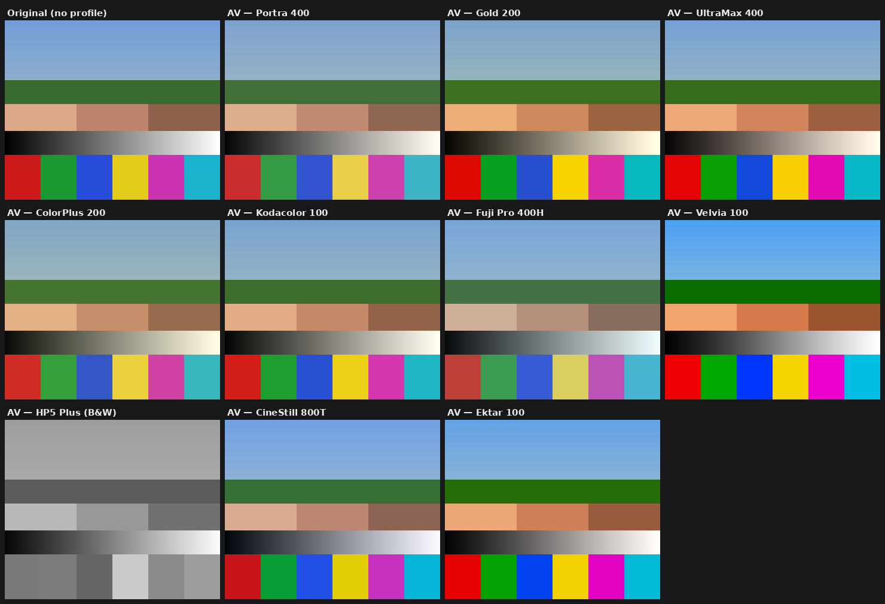

# Analog Vision LUTs — Film-emulation profiles for Lightroom & Camera Raw

Ten original film-look **camera profiles** (`.xmp`) with embedded 3D LUTs, ready
to import into Lightroom Classic, Lightroom CC, and Adobe Camera Raw (10.3+).

Inspired by the lineup of *Analog Vision Studio V2* (Lumenary Vision), these are
**original emulations** — built from a parametric film model that reproduces the
documented *character* of each stock (tone response, colour crosstalk, white
balance, split-tone). No proprietary scan data is used.



## The 10 profiles

| # | Profile | Character |
|---|---------|-----------|
| 01 | **Portra 400** | Warm-neutral skin, gentle low contrast, creamy highlight rolloff |
| 02 | **Gold 200** | Nostalgic golden warmth, amber highlights, punchy mids |
| 03 | **UltraMax 400** | Consumer warmth, magenta-red lean, higher contrast & saturation |
| 04 | **ColorPlus 200** | Vintage muted warmth, soft contrast, yellow-green mids |
| 05 | **Kodacolor 100** | Clean classic Kodak warmth, balanced contrast |
| 06 | **Fuji Pro 400H** | Cool airy pastels, mint-cyan greens, lifted blacks |
| 07 | **Velvia 100** | Ultra-saturated slide film, deep contrast, vivid blues & greens |
| 08 | **HP5 Plus** | Classic medium-contrast B&W, smooth tonality, neutral-cool tone |
| 09 | **CineStill 800T** | Tungsten cinema look: teal shadows, warm red halation, cool cast |
| 10 | **Ektar 100** | Vivid yet accurate, fine grain, punchy reds, clean vibrant blues |

## Install

**Lightroom Classic / Camera Raw**

1. Copy the files in `profiles/` into the Camera Raw settings folder:
   - **macOS:** `~/Library/Application Support/Adobe/CameraRaw/Settings/`
   - **Windows:** `C:\Users\<you>\AppData\Roaming\Adobe\CameraRaw\Settings\`
2. Restart Lightroom Classic / Photoshop.
3. In **Develop → Profile Browser**, open the **Analog Vision** group and pick a look.

**Lightroom (CC / cloud / mobile)**

In the Edit panel, open **Profiles → the `+` / Import Profiles**, and select the
`.xmp` files. They sync to mobile via Creative Cloud.

> Tip: profiles are non-destructive and carry an **Amount** slider — dial the
> intensity up or down per photo, then keep editing on top.

## How they're built

Everything is generated from source — nothing is hand-encoded.

- `generate_profiles.py` — the film model + Adobe encoder. Builds a `32³` RGB LUT
  per stock and writes it as an enhanced `.xmp` profile.
- `validate.py` — decodes each `.xmp` back to its LUT and verifies it matches the
  source colour science (round-trips to within the 16-bit quantisation floor),
  plus header/footer/MD5 integrity.
- `preview.py` — renders `preview.png`, applying each LUT to a synthetic test scene.

```bash
pip install numpy pillow
python3 generate_profiles.py   # -> profiles/*.xmp
python3 validate.py            # round-trip + integrity check
python3 preview.py             # -> preview.png
```

### Colour-science pipeline

Each sample runs through a physically-motivated chain (display-referred sRGB, the
convention every photographic `.cube` LUT uses):

```
sRGB → linear
  → white balance (per-channel linear gain)
  → coupler crosstalk (3×3, near-identity → hue character / inter-layer effects)
  → saturation around Rec709 luma
linear → sRGB
  → contrast S-curve → gamma → black lift / white rolloff
  → split-tone (shadow + highlight tints, luma-weighted)
```

Monochrome stocks (HP5) use a spectral channel mix → film tone → subtle toner tint.

### Encoder format

The embedded LUT matches Adobe's public *enhanced-profile* format so the files
import natively:

- `32³` RGB grid, samples stored as **residual-from-identity** `uint16` (so an
  identity LUT compresses to near-zero), ordered with B fastest in the payload.
- Block = `[1,1,3,size]` header + samples + `[0,1,0]` + `[0.0, 2.0]` footer.
- Compressed with zlib behind a 4-byte raw-size prefix, then encoded with Adobe's
  custom 85-character alphabet (XML-attribute-safe — no `" < > &`).
- `crs:RGBTable` / `crs:Table_<hash>` are keyed by the MD5 of the uncompressed block.

## Notes & limitations

- Warm stocks intentionally tint the highlights/whites (authentic to the film) —
  this is by design, not a white-balance bug.
- Adobe caps embedded RGB tables at `32³`; that's what these use (no downsampling).
- These are looks for tuning, not colorimetric film scans. Use the profile Amount
  slider and the usual Develop controls to taste.
