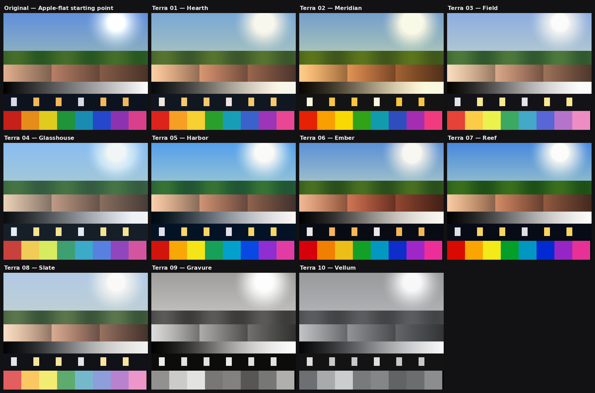

# TERRA — ten authored color looks for Lightroom

A designed system of camera profiles, not a pile of presets. Built for
photographs that begin as Apple-processed iPhone HEICs and are finished in
Lightroom Classic / Camera Raw.



## Philosophy

Three ideas, drawn from studying how the best in the field think about color:

1. **Photographic, not filtered** (the Halide / Process Zero ethos). Every look
   should read as *nice light*, not an effect: soft highlight roll-off instead
   of clipping, gentle grain-friendly contrast, restrained saturation. The
   deliberate result of Lux's single-exposure processing is "less saturated,
   softer" than a stock phone photo — that restraint is the north star here.

2. **Undo the iPhone, don't amplify it.** Smart HDR and Deep Fusion apply
   *local* tone mapping that flattens global contrast, greys out skies and
   pre-warms skin. So every Terra look rebuilds real tonal weight (a proper
   S-curve, density in the blacks), pulls highlights back toward a believable
   sun, and **never** adds saturation to skin — Apple already spent that budget.

3. **A system, not ten strangers.** All ten looks share one DNA — the same
   filmic tone engine, the same skin protection, the same shadow-cool /
   highlight-warm split logic scaled per family — so any two of them applied
   to the same photo look like siblings.

## The engine (what's inside the LUT)

The technical heart is an **AgX-style tone pipeline** (after Troy Sobotka's
work, as shipped in Blender and darktable): the image is compressed into an
*inset gamut*, a per-channel filmic sigmoid is applied there, then it is
re-expanded slightly *more* than it was compressed. Two film behaviours fall
out of this for free:

- **Path to white** — saturated colors gracefully desaturate as they brighten
  (a sunset walks to cream, not neon), which is the single biggest thing that
  separates *film* from *filter*.
- **Contrast carries saturation** (the Hunt effect, per dcamprof's "neutral
  tone reproduction") — so no crude saturation slider is needed.

On top of that: **hue-band color sculpting** (eight smooth bands baked into the
LUT — this is how Glasshouse gets mint greens and Field suppresses magenta),
luma-weighted **split-toning**, and a **tinted matte toe** per family.
Monochrome looks use a spectral channel mix and a duotone toner that protects
paper-white and max-black.

## The range

| Family | Look | Voice |
|---|---|---|
| Warm | **01 Hearth** | The anchor. Creamy golden highlights, cool matte shadows, olive greens, skin first. Portra spirit. |
| Warm | **02 Meridian** | Golden-hour nostalgia, amber poured over everything. Gold 200 spirit. |
| Documentary | **03 Field** | Muted, hard honest shadows, suppressed magenta. Classic Chrome spirit for street & travel. |
| Cool | **04 Glasshouse** | Pastel air: mint greens, luminous lifted shadows, soft cyan skies. Pro 400H spirit. |
| Cinematic | **05 Harbor** | Night cinema: teal shadows vs tungsten-warm lights, protected skin. CineStill spirit. |
| Cinematic | **06 Ember** | Dense and timeless, rich glowing reds, deep blacks. Kodachrome spirit. |
| Vivid | **07 Reef** | Hue-accurate punch — deep skies, clear water — skin kept honest. Ektar spirit. |
| Vivid | **08 Slate** | Silver and severe: bleach-bypass restraint for hard light, concrete, winter. |
| Mono | **09 Gravure** | Punchy B&W, deep blacks, darkened skies. Tri-X spirit. |
| Mono | **10 Vellum** | Calm B&W, long smooth tonality, selenium cool. Acros spirit. |

Every look supports Lightroom's **Amount slider** (0–200): they are tuned to be
clearly present at 100 — dial down for a whisper, up for a statement.

## Install

**Lightroom Classic** (simplest): Develop → Profile Browser (four-squares
icon) → `⋯` menu → **Import Profiles…** → select the files in `profiles/`.
They appear under the **Terra** group. No restart needed.

Or copy `profiles/*.xmp` into
`~/Library/Application Support/Adobe/CameraRaw/Settings/` (macOS) and restart.

## Build & verify

```bash
pip install numpy pillow
python3 generate_terra.py    # -> profiles/*.xmp
python3 validate_terra.py    # decode each xmp, round-trip check (≤1 LSB)
python3 lookbook.py          # -> terra_lookbook.png
```

## Research sources

- Lux — [Introducing Process Zero](https://www.lux.camera/introducing-process-zero-for-iphone/) · [Process Zero manual](https://www.lux.camera/process-zero-manual/) · [PetaPixel on Halide's "anti-intelligent" update](https://petapixel.com/2024/08/14/halides-anti-intelligent-update-makes-iphone-photos-truly-natural/)
- iPhone pipeline critique — [Michael Tsai's roundup](https://mjtsai.com/blog/2023/01/10/iphone-camera-over-processing/)
- Anders Torger — [dcamprof / neutral tone reproduction](https://torger.se/anders/dcamprof.html)
- Troy Sobotka — [AgX](https://github.com/sobotka/AgX-Resolve) · [darktable agx module](https://docs.darktable.org/usermanual/development/en/module-reference/processing-modules/agx/)
- Pat David — [film emulation Hald CLUTs](https://patdavid.net/2015/03/film-emulation-in-rawtherapee/)
- [abpy/FujifilmCameraProfiles](https://github.com/abpy/FujifilmCameraProfiles) (Fuji sim signatures)
- [Filmulator](https://github.com/mermerico/filmulator) (film development simulation)
- Film-stock signatures: [Portra 400 guide](https://www.tonywodarck.com/education/2023/6/18/kodak-portra-400-film-guide) · [CineStill 800T](https://www.daydreamfilm.app/blog/film-reviews/cinestill-800t-review) · [Classic Chrome](https://www.fujifilm-x.com/global/stories/film-simulation-classic-chrome/) · [Tri-X vs HP5](https://thedarkroom.com/kodak-tri-x-vs-ilford-hp5/) · [teal & orange](https://petapixel.com/2017/02/23/orange-teal-look-popular-hollywood/)

## Honest limitations

- A LUT is per-pixel color only: no grain, no halation bloom, no adjacency
  effects (those are spatial). Add Lightroom grain to taste (amount ~15–25,
  size ~25 suits these looks).
- These are display-referred looks for already-processed photos — they are
  authored color, not colorimetric film measurements.
